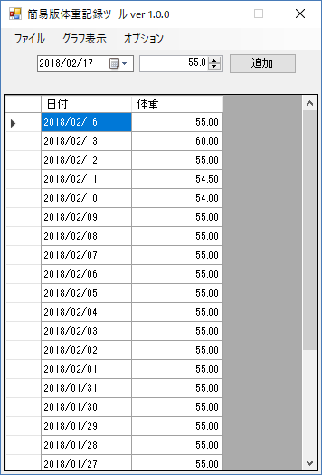
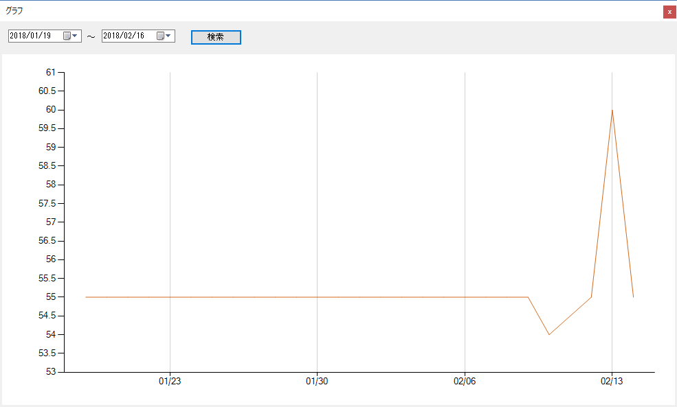

# TinyBodyWeightRecorder
簡易版体重記録ツール

## データ構成
* 日付
* 体重(数値)

## 機能
- [X] ~~日々の入力~~  ※実装しない
- [X] 入力データの編集
- [X] 入力データの削除
- [X] 指定期間の折線グラフ
- [X] データの保存
- [X] データ読み込み

## 機能改善
- [ ] メインウィンドウ
  - [ ] 自動保存
- [ ] グラフウィンドウ
  - [X] 最大化取りやめ
  - [ ] ウィンドウサイズと位置の保存と読み込み

## 画面説明
### メインウィンドウ
  
 - メニュー
   - ファイル
     - 保存：現在のグリッド内容を上書き保存する
   - グラフ：グラフウィンドウを表示する
 - 画面上部：新規追加
   - 日付：測定日付(本日日付が初期値)
   - 体重：数値のみ入力可能
   - 追加ボタン:体重が0ではない場合のみグリッドに追加する
 - グリッド
   - 日付：変更不可
   - 体重：変更可能

### グラフウィンドウ
  
 - 体重推移をグラフ表示する